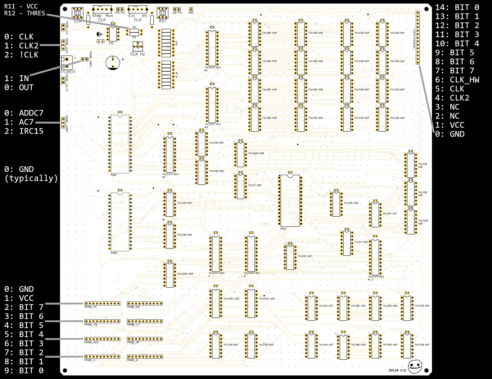
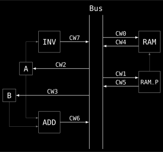

# The _**S**tupid **P**oorly **E**ngineered **A**pplication **R**unner_

A very simple CPU and the target platform of the [Large Headache Compiler](https://github.com/Ryz3D/LHC). This repository contains all hardware schematics and an implementation in Logisim.

## Features

- 16-bit instruction register
  - Up to 65k instructions
- 8-bit control word and 8-bit literal
- Two 8-bit registers (`A` and `B`)
  - Operations:
  - `ADD`: Outputs sum of `A` and `B`
  - `INV`: Outputs two's complement of `A`
- 8-bit RAM pointer register
  - 256-byte RAM
- Jump by writing target address to RAM address 1 and 2
- Conditional jump (if `A` < 0) by writing target address to RAM address 3 and 4
- 8-bit hardware output by writing to RAM address 7

## Technical details

### Instructions

ROM1 contains the 8 bit control word (CW), ROM2 contains the 8 bit literal (LIT), both are part of the current instruction. Thus they are always addressed identically, both by the instruction register IR _(I learned in the meantime "program counter" would've been the appropiate name)_. \
The CW controls which component writes to the bus (MSB bits 4-7) and which components read from the bus (LSB bits 0-3). If no component is selected to output (CW4-CW7 are all zero), the literal is written to the bus.

From bus to...
- **CW0** (`RAM`): RAM
- **CW1** (`RAM_P`): RAM pointer
- **CW2** (`A`): A
- **CW3** (`B`): B

To bus from...
- **CW4** (`RAM`): RAM
- **CW5** (`RAM_P`): RAM pointer
- **CW6** (`ADD`): Adder (`A` + `B`)
- **CW7** (`INV`): Inverse (two's complement) of A (-`A`)

The basic bus structure is also shown in the following diagram.

> [!WARNING]
> Multiple read bits (CW0-CW3) are possible, but multiple write bits (CW4-CW7) may damage actual hardware. Be careful to activate only one of these bits. (_Especially when erasing flash chips, erasing typically writes all ones, overwrite the entire chip to all zeros_)

### Special addresses

RAM addresses 8-255 are freely useable, addresses 0-7 are reserved for special functions described in the following table.

| RAM pointer | Usage                                     |
| ----------- | ----------------------------------------- |
| 0           | Reserved                                  |
| 1           | Prepare jump (8 MSB)                      |
| 2           | Perform jump (8 LSB)                      |
| 3           | Prepare conditional jump (8 MSB)          |
| 4           | Perform conditional jump if A < 0 (8 LSB) |
| 5           | Return address (8 MSB)                    |
| 6           | Return address (8 LSB)                    |
| 7           | Hardware I/O                              |

### Examples

Typical instructions for addition and subtraction are shown in the following example.

| Description | Assembly     | CW       |
| ----------- | ------------ | -------- |
| RAM = A + B | `ADD -> RAM` | 01000001 |
| RAM = B - A | `INV -> A`   | 10000100 |
|             | `ADD -> RAM` | 01000001 |

To specify a literal value in assembly language, simply write the value on the left side.

| Description | Assembly     | CW       | LIT      |
| ----------- | ------------ | -------- | -------- |
| RAM_P = 8   | `8 -> RAM_P` | 00000010 | 00001000 |
| RAM = 127   | `127 -> RAM` | 00000001 | 01111111 |

A jump to address 0x1020 is shown in the following example.

| Description              | Assembly     | CW       | LIT      |
| ------------------------ | ------------ | -------- | -------- |
| Prepare jump (set 8 MSB) | `1 -> RAM_P` | 00000010 | 00000001 |
|                          | `16 -> RAM`  | 00000001 | 00010000 |
| Perform jump (set 8 LSB) | `2 -> RAM_P` | 00000010 | 00000010 |
|                          | `32 -> RAM`  | 00000001 | 00100000 |

A return statement has to be written manually, like in the following example (_I know it's tedious, but it does make for a simple architecture_).

| Description                 | Assembly     | CW       | LIT      |
| --------------------------- | ------------ | -------- | -------- |
| Load return address (8 MSB) | `5 -> RAM_P` | 00000010 | 00000101 |
| Store in `A`                | `RAM -> A`   | 00010100 | 00000000 |
| Reset `B` (so `ADD`=`A`)    | `0 -> B`     | 00001000 | 00000000 |
| Prepare jump (set 8 MSB)    | `1 -> RAM_P` | 00000010 | 00000001 |
|                             | `ADD -> RAM` | 01000001 | 00000000 |
| Load return address (8 LSB) | `6 -> RAM_P` | 00000010 | 00000110 |
| Store in `A`                | `RAM -> A`   | 00010100 | 00000000 |
| Perform jump (set 8 LSB)    | `2 -> RAM_P` | 00000010 | 00000010 |
|                             | `ADD -> RAM` | 01000001 | 00000000 |

## Mistakes

The PCB design is missing some pull-down resistors to function properly. Namely some for unused inputs (NOR1, NOR2, NOR3, ROM A16-A17, RAM A8-A14) aswell as for the upper byte of `IR_IN` (IR_IN8-IR_IN15). This is fixable by soldering these resistors to the back. Pins IR_IN8-IR_IN15 can be accessed via the pins of BUF3-BUF4.
